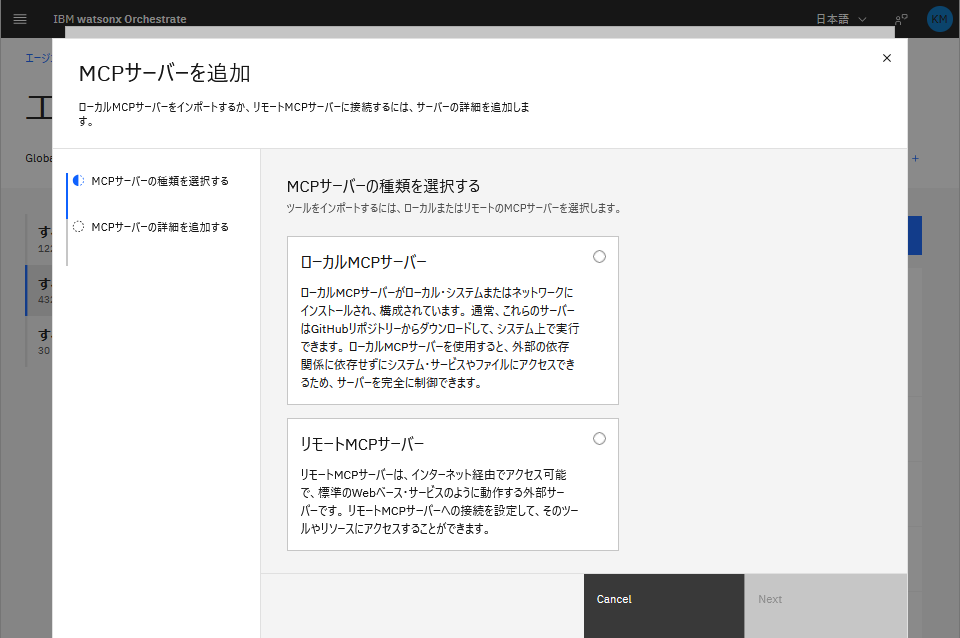

# Track A — IBM watsonx Orchestrate 公式ドキュメント検索（Streamable HTTP）

wxO ADK の公式ドキュメントサーバー（`developer.watson-orchestrate.ibm.com/mcp`）に
**Streamable HTTP** でリモート接続し、自然言語でドキュメントを検索するエージェントを作ります。

このサーバーは IBM が公式に公開しているパブリック MCP サーバーです。
認証不要・Connection 設定不要で、YAML と 2 つの CLI コマンドだけで完結します。

---

## 前提条件

- IBM watsonx Orchestrate（SaaS）
- `orchestrate` CLI（[ADK](https://github.com/IBM/ibm-watsonx-orchestrate-adk) に同梱）
- `orchestrate env activate <env>` で環境をアクティブにしておくこと

---

## セットアップ

### リポジトリを取得

```bash
git clone https://github.com/matsuo-iguazu/wxo-mcp-lab.git
cd wxo-mcp-lab/03_remote-mcp/track-a
```

### リソース名について

このトラックで作成するリソースの名称は以下のとおりです。
チームの命名規則に合わせて YAML ファイルを適宜編集してください。

| リソース | サンプル名 |
|---|---|
| Toolkit | `m-adk-docs` |
| エージェント | `M_adk_docs_agent` |

---

## 手順

2 通りの方法で設定できます。UI の方がハードルが低く、YAML/CLI 版はコード管理・自動化に向いています。

---

### 方法 A：UI から設定する（YAML・CLI 不要）

#### MCP サーバーの登録

1. **「エージェントとツールの構築」→「すべてのツール」→「ツールの作成 +」**
2. **「追加元」→「MCPサーバー」** を選択
3. **「MCP サーバーの追加 +」タブ** をクリック
4. **「リモートMCPサーバー」** を選択 → **Next**

   

5. フォームに入力：

   | フィールド | 値 |
   |---|---|
   | サーバー名 | `m-adk-docs` |
   | 説明 | IBM watsonx Orchestrate ADK 公式ドキュメントを検索するリモート MCP。認証不要。 |
   | MCPサーバーURL | `https://developer.watson-orchestrate.ibm.com/mcp` |
   | トランスポート・タイプ | **ストリーム可能HTTP**（デフォルトのまま） |
   | 接続を選択 | なし（認証不要） |

   

6. **「Connect」** → 成功バナーが表示されツールが追加される → **「完了」**

> **トランスポートタイプの選び方**
> - サービスのドキュメントを確認するのが基本
> - URL が `/sse` で終わっていたら SSE の可能性が高い
> - わからなければ **ストリーム可能HTTP を先に試す** → 失敗したら SSE に切り替え

#### エージェントの作成

1. **「すべてのエージェント」→「エージェントの作成 +」**
2. **「ツールセット」タブ →「ツールの追加 +」→「ローカル・インスタンス」**
   - `adk` で検索 → `m-adk-docs:search_ibm_watsonx_orchestrate_adk` を選択 → **「エージェントに追加」**
3. **「動作」タブ →「指示」欄** に以下を貼り付け：

   ```
   あなたは IBM watsonx Orchestrate（wxO）の専門アシスタントです。
   ユーザーの質問に応じて、以下のツールを使って ADK 公式ドキュメントを検索し、日本語で回答してください。

   ツールの使い方:
   - search_ibm_watsonx_orchestrate_adk: キーワードやフレーズで関連ドキュメントを検索する
     重要1: ドキュメントは英語のため、検索クエリは必ず英語で入力すること。
     例: ユーザーが「MCP の接続方法」と聞いたら "MCP toolkit connection" で検索する。
     重要2: version パラメータは絶対に指定しないこと。常に query のみで呼び出すこと。

   回答ルール:
   1. 必ず日本語で回答すること
   2. 参照したドキュメントのページ名・URL を明示すること
   3. わからない場合は「ドキュメントに記載が見つかりませんでした」と正直に伝えること
   ```

4. 右側の **プレビュー** でテスト → **「デプロイ」**

   

---

### 方法 B：CLI から設定する（YAML ファイル使用）

### 1. Toolkit をインポート

```bash
orchestrate toolkits import -f toolkits/m-adk-docs.yaml
```

インポート時に wxO がリモートサーバーに接続し、ツール一覧を取得します（30 秒タイムアウト）。

### 2. インポートされたツールを確認

```bash
orchestrate tools list | grep m-adk-docs
```

以下のツールが表示されれば成功です：

```
m-adk-docs:search_ibm_watsonx_orchestrate_adk
```

### 3. エージェントをインポート

```bash
orchestrate agents import -f agents/M-adk-docs-agent.yaml
```

### 4. テスト

wxO チャットで `M_adk_docs_agent` を選択して話しかけます：

```
MCP ツールキットの接続方法を教えて
→ toolkits/mcp-servers のドキュメントを参照して回答

エージェントの YAML に書ける llm の種類は？
→ 利用可能なモデル一覧を検索して回答

リモート MCP と ローカル MCP の違いは何ですか？
→ remote_mcp_toolkits のページを検索して回答
```

---

## 一括実行（import-all.sh）

手順 1〜3 を一括実行できます：

```bash
chmod +x import-all.sh
./import-all.sh
```

---

## 再デプロイ

Toolkit は上書き不可のため、再インポート時は先に削除します：

```bash
orchestrate toolkits delete m-adk-docs
orchestrate agents delete M_adk_docs_agent
./import-all.sh
```

---

## 検証メモ

### Connection が不要な理由

`developer.watson-orchestrate.ibm.com/mcp` は IBM が公開しているパブリックサーバーのため、
認証は不要です。Toolkit YAML に `connections:` を書く必要はありません。

ローカル MCP でデータベースや外部 API に接続する場合は、
接続文字列や API キーを `connections:` + `set-credentials` で渡す必要があります（`01_postgres-mcp` 参照）。

### ツール名の確認

`orchestrate toolkits import` 実行後、接続先サーバーが公開しているツール名は
`orchestrate tools list` で確認できます。
エージェント YAML の `tools:` には `toolkit名:tool名` 形式で記述します。

```yaml
tools:
  - m-adk-docs:search_ibm_watsonx_orchestrate_adk
```

### エージェント instructions のポイント

このサーバーで動作確認できた注意点を 2 つ記録する。

**1. 検索クエリは英語で行う**

ドキュメントが英語のため、日本語クエリでは検索にヒットしない。
エージェントに「検索は英語で行う」と明示することで、日本語の質問でも正しく検索できるようになる。

**2. `version` パラメータを指定しない**

ツールには省略可能な `version` パラメータがある。
LLM が自動的に `version: "v0.7"` などを付与すると結果が極端に絞られてしまう。
instructions で「version パラメータは指定しないこと」と明記する必要がある。
