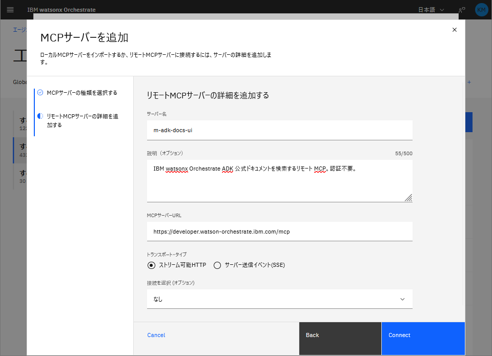
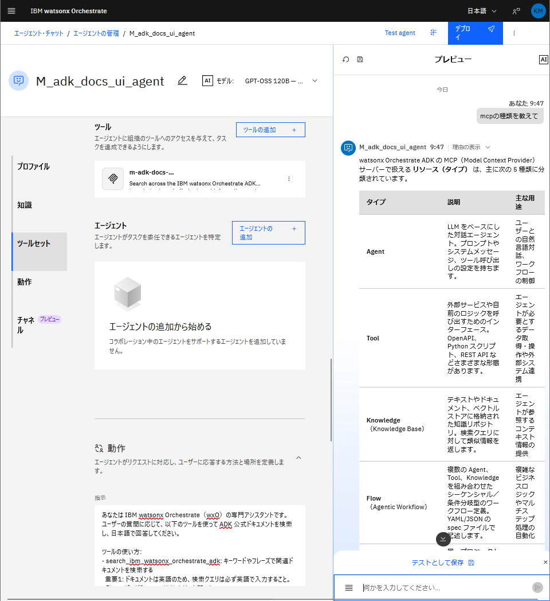

# wxO から公式ドキュメントをリモート MCP で検索する（Streamable HTTP）

IBM watsonx Orchestrate（wxO）のエージェントから、インターネット上の公開 MCP サーバーに接続する方法を試しました。

今回は **Streamable HTTP** を使い、IBM が公式公開している ADK ドキュメントサーバーに接続して「日本語で質問 → 英語ドキュメントを検索 → 日本語で回答」するエージェントを作ります。

コードは [wxo-mcp-lab/03_remote-mcp/track-a](https://github.com/matsuo-iguazu/wxo-mcp-lab/tree/main/03_remote-mcp/track-a) に置いています。

---

## ローカル MCP との違い

これまでの記事（[Track A: PostgreSQL 接続](https://qiita.com/IG_Matsuo/items/9106a80d26fbe3b736e0) / [Track B: FastMCP](https://qiita.com/IG_Matsuo/items/ecaf203af45d6737705b)）では「ローカル MCP」を使っていました。ローカル MCP は wxO クラウド上で `npx` や `python` コマンドを起動する方式です。

**リモート MCP** は全然違います。

| | ローカル MCP | リモート MCP |
|---|---|---|
| サーバーの用意 | 必要（npm / Python ファイル） | **不要**（公開サーバーを使う） |
| YAML の書き方 | `command:` | `transport:` + `server_url:` |
| 認証 | `connections:` で環境変数を注入 | サーバー次第（公開なら不要） |
| 通信方式 | STDIO | **Streamable HTTP** or **SSE** |

リモート MCP はサーバーを自分で用意する必要がなく、URL を指定するだけで接続できます。

---

## 接続先：IBM ADK 公式ドキュメントサーバー

`https://developer.watson-orchestrate.ibm.com/mcp`

IBM が公式に公開しているパブリック MCP サーバーです。このサーバーは [ADK（ibm-watsonx-orchestrate-adk）](https://github.com/IBM/ibm-watsonx-orchestrate-adk) の開発者向けドキュメントを MCP ツールとして提供しています。

- 認証不要
- GitHub サインアップ不要
- Connection 設定不要

公開しているツールは `search_ibm_watsonx_orchestrate_adk` 1本で、キーワードで関連ドキュメントを検索して返してくれます。

---

## 設定方法：UI と CLI の両方に対応

**UI（画面操作のみ）** と **CLI + YAML ファイル** の両方で設定できます。

UI は「まず動かしてみたい」人向け。CLI は「YAML でコード管理したい・CI/CD に組み込みたい」人向けです。

詳しい手順は [GitHub の README](https://github.com/matsuo-iguazu/wxo-mcp-lab/tree/main/03_remote-mcp/track-a) にまとめています。

### UI の場合（概要）

「ツールの作成 +」→「MCPサーバー」→「リモートMCPサーバー」を選択し、URL とトランスポートタイプを入力するだけです。





:::note
**トランスポートタイプの選び方**：サービスのドキュメントを確認するのが基本。IBM ADK サーバーは Streamable HTTP（ストリーム可能HTTP）と明記されています。わからなければ Streamable HTTP を先に試してみてください。
:::

### CLI の場合（YAML ファイル）

## YAML ファイル（コードで管理したい場合）

### Toolkit（toolkits/m-adk-docs.yaml）

```yaml
spec_version: v1
kind: mcp
name: m-adk-docs
description: >
  IBM watsonx Orchestrate ADK 公式ドキュメントを検索するリモート MCP ツールキット。
  Streamable HTTP でパブリックサーバーに接続する。認証不要。
transport: streamable_http
server_url: https://developer.watson-orchestrate.ibm.com/mcp
tools:
  - "*"
```

ローカル MCP では `command:` を書いていたところが `transport: streamable_http` と `server_url:` に変わるだけです。シンプル。

### Agent（agents/M-adk-docs-agent.yaml）

```yaml
spec_version: v1
kind: native
name: M_adk_docs_agent
description: >
  IBM watsonx Orchestrate ADK の公式ドキュメントを自然言語で検索するエージェント。
  リモート MCP ツールキット m-adk-docs を通じてドキュメントサーバーに接続する。
instructions: |
  あなたは IBM watsonx Orchestrate（wxO）の専門アシスタントです。
  ユーザーの質問に応じて、以下のツールを使って ADK 公式ドキュメントを検索し、日本語で回答してください。

  ツールの使い方:
  - search_ibm_watsonx_orchestrate_adk: キーワードやフレーズで関連ドキュメントを検索する
    重要1: ドキュメントは英語のため、検索クエリは必ず英語で入力すること。
    例: ユーザーが「MCP の接続方法」と聞いたら "MCP toolkit connection" で検索する。
    重要2: version パラメータは絶対に指定しないこと。常に query のみで呼び出すこと。

  回答ルール:
  1. 必ず日本語で回答すること
  2. 参照したドキュメントのページ名・URL を明示すること
  3. 複数の関連ページがある場合はまとめて紹介すること
  4. わからない場合は「ドキュメントに記載が見つかりませんでした」と正直に伝えること
llm: groq/openai/gpt-oss-120b
style: react
tools:
  - m-adk-docs:search_ibm_watsonx_orchestrate_adk
```

エージェントの `tools:` には `toolkit名:tool名` 形式で書きます。

---

## 手順

```bash
# 1. Toolkit をインポート
orchestrate toolkits import -f toolkits/m-adk-docs.yaml

# 2. インポートされたツール名を確認
orchestrate tools list | grep m-adk-docs

# 3. エージェントをインポート
orchestrate agents import -f agents/M-adk-docs-agent.yaml
```

Toolkit のインポート時に wxO がリモートサーバーに接続してツール一覧を取得します（30 秒タイムアウト）。

---

## ハマりポイント

実際に動かすまでに 2 つハマりました。

### 1. 検索クエリを英語にしないとヒットしない

ドキュメントが英語のため、日本語のまま `search_ibm_watsonx_orchestrate_adk` を呼び出してもヒットしません。

エージェントへの質問は日本語でも、ツールへのクエリは英語に変換するよう `instructions` に明記することで解決します。

```
重要1: ドキュメントは英語のため、検索クエリは必ず英語で入力すること。
例: ユーザーが「MCP の接続方法」と聞いたら "MCP toolkit connection" で検索する。
```

### 2. LLM が version パラメータを勝手に付ける

このツールには省略可能な `version` パラメータがあります。LLM が「丁寧に」`version: "v0.7"` などを自動付与すると、そのバージョンにしか存在しないドキュメントしかヒットしなくなり、結果が激減します。

`instructions` に「version パラメータは絶対に指定しないこと」と書いておくだけで防げます。

```
重要2: version パラメータは絶対に指定しないこと。常に query のみで呼び出すこと。
```

---

## 動作確認

wxO チャットで `M_adk_docs_agent` に話しかけると、日本語で回答してくれます。

```
Q: MCP ツールキットの接続方法を教えて
A: 以下のドキュメントが見つかりました…
   - MCP Servers | watsonx Orchestrate（URL）
   …（日本語でまとめて回答）
```

---

## まとめ

- リモート MCP は `transport:` + `server_url:` を書くだけ。`command:` 不要
- IBM 公式の ADK ドキュメントサーバーは認証不要で即使える
- 英語ドキュメントを日本語で検索するには、instructions で「クエリは英語で」と明記する
- `version` パラメータを LLM が自動付与するのを防ぐため、使わないよう instructions に書く

次の [Track B](https://qiita.com/IG_Matsuo/) では SSE を使い、GitMCP で GitHub リポジトリを MCP サーバー化する方法を紹介します。
